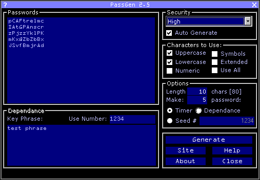



## PassGen 2\.5

### Description

This is the newest version of my password generator. PassGen 2.5 is a moderately sophisticated psuedo-random password generator. It has many different generation password generation methods, with more to come in the future. It supports psuedo-random password generation based on the system timer, seed number and passphrase. It can make many passwords in one go and can make passwords up to 999 bytes (7992 bits) in length. All that with a stylish interface makes it a very capable password generator. Definately on of the best I've seen. See the readme for mor information.
 
### More Info
 

             |
---                |---
**Submitted On**   |2000-05-09 02:36:50
**By**             |[John Pettit](https://github.com/Planet-Source-Code/PSCIndex/blob/master/ByAuthor/john-pettit.md)
**Level**          |Intermediate
**User Rating**    |5.0 (15 globes from 3 users)
**Compatibility**  |VB 5\.0, VB 6\.0
**Category**       |[Complete Applications](https://github.com/Planet-Source-Code/PSCIndex/blob/master/ByCategory/complete-applications__1-27.md)
**World**          |[Visual Basic](https://github.com/Planet-Source-Code/PSCIndex/blob/master/ByWorld/visual-basic.md)
**Archive File**   |[CODE\_UPLOAD5634592000\.zip](https://github.com/Planet-Source-Code/john-pettit-passgen-2-5__1-7980/archive/master.zip)

